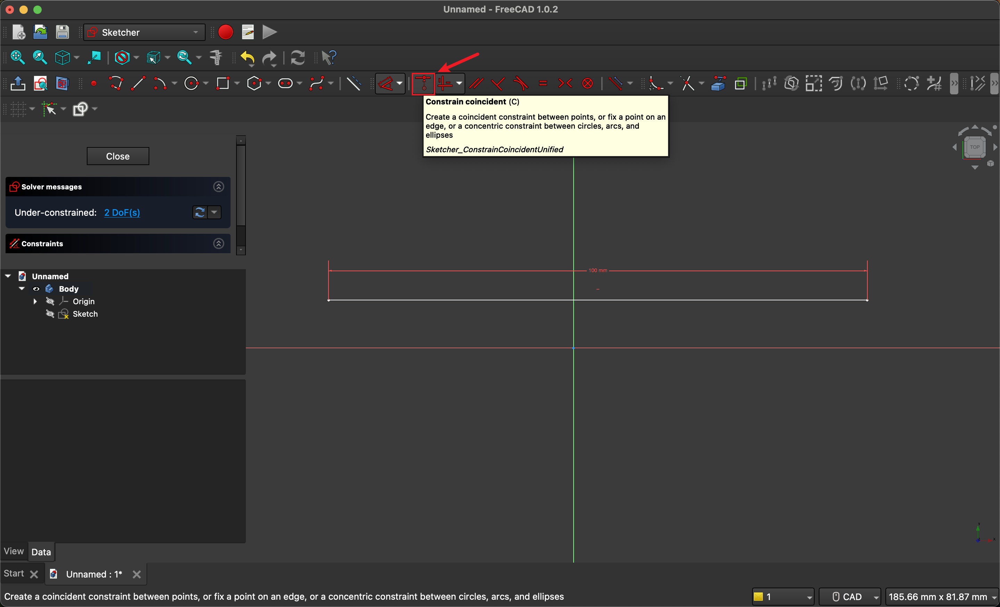

# FreeCAD 제약조건(Constraints) 튜토리얼

## 목차
1. [개요](#개요)
2. [스케치 생성](#스케치-생성)
3. [선 그리기](#선-그리기)
4. [제약조건(Constraints) 적용](#제약조건constraints-적용)
   - 4.1 [Horizontal/Vertical 제약조건](#1-horizontalvertical)
   - 4.2 [Distance 제약조건](#2-distance)
   - 4.3 [Coincident 제약조건](#3-coincident)
   - 4.4 [Parallel 제약조건](#4-parallel)
   - 4.5 [Perpendicular 제약조건](#5-perpendicular)
   - 4.6 [Equal 제약조건](#6-equal)
   - 4.7 [Tangent 제약조건](#7-tangent)
   - 4.8 [Symmetric 제약조건](#8-symmetric)
   - 4.9 [Block 제약조건](#9-block)

## 개요

제약조건(Constraints)은 FreeCAD에서 스케치의 형상을 정확하게 정의하는 핵심 기능입니다. 제약조건을 통해 다음과 같은 작업이 가능합니다:

- **형상의 정확한 치수 지정**: 길이, 각도, 반지름 등을 정확히 설정
- **기하학적 관계 정의**: 평행, 수직, 접선 등의 관계 설정
- **완전 구속 스케치 생성**: 모든 자유도를 제거하여 안정적인 3D 모델링 기반 구축

> **💡 팁**: 완전 구속된 스케치는 녹색으로 표시되며, 미완전 구속 스케치는 흰색으로 표시됩니다.

## 스케치 생성

### 1. 새 문서

### 2. 새 스케치

### 3. 스케치 평면 선택

## 선 그리기

## 제약조건(Constraints) 적용

제약조건은 스케치 요소들 간의 관계를 정의하여 정확하고 안정적인 형상을 만드는 데 사용됩니다. 각 제약조건의 특징과 사용법을 알아보겠습니다.

### 1. Horizontal/Vertical

**목적**: 선분을 수평 또는 수직으로 고정합니다.

**사용 시기**: 
- 정확한 수평선이나 수직선이 필요할 때
- 건축 도면이나 기계 부품의 기본 축을 설정할 때

**적용 방법**:
1. 제약조건을 적용할 선분을 선택
2. Horizontal 또는 Vertical 제약조건 버튼 클릭
3. 선분이 자동으로 수평 또는 수직으로 조정됨

> **⚠️ 주의**: 이미 다른 제약조건으로 고정된 선분에는 적용할 수 없습니다.

✨ **실습**: Horizontal Constraint를 적용한 후, 같은 선분에 Vertical도 적용하여 어떤 일이 일어나는지 확인해보세요.

### 2. Distance

**목적**: 두 점 사이의 거리나 선분의 길이를 정확히 지정합니다.

**사용 시기**:
- 부품의 정확한 치수가 필요할 때
- 두 요소 간의 간격을 일정하게 유지해야 할 때

**적용 방법**:
1. 거리를 측정할 두 점 또는 한 개의 선분을 선택
2. Distance 제약조건 버튼 클릭
3. 대화상자에서 원하는 치수값 입력

**관련 제약조건**:
- **Angle**: 두 선분 사이의 각도 지정
- **Radius**: 원이나 호의 반지름 지정  
- **Diameter**: 원의 지름 지정

✨ **실습**: Distance 적용 후 Angle, Radius, Diameter 제약조건도 각각 사용해보세요.

### 3. Coincident

**목적**: 두 점을 같은 위치에 고정하거나, 점을 선 위에 고정합니다.

**사용 시기**:
- 여러 선분이 한 점에서 만나야 할 때
- 점을 특정 선 위에 위치시켜야 할 때
- 연결된 형상을 만들 때

**적용 방법**:
1. 일치시킬 두 점을 선택 (또는 점과 선을 선택)
2. Coincident 제약조건 버튼 클릭
3. 선택된 요소들이 자동으로 일치됨

> **💡 팁**: Coincident는 스케치에서 가장 기본적이고 중요한 제약조건 중 하나입니다.

### 4. Parallel

**목적**: 두 선분을 평행하게 만듭니다.

**사용 시기**:
- 평행한 모서리가 있는 부품을 설계할 때
- 일정한 간격을 유지하는 구조물을 만들 때
- 대칭적인 형상을 설계할 때

**적용 방법**:
1. 평행하게 만들 두 선분을 선택
2. Parallel 제약조건 버튼 클릭
3. 두 선분이 자동으로 평행하게 조정됨

> **💡 팁**: Parallel 제약조건은 각도는 고정하지만 위치나 길이는 고정하지 않습니다.

### 5. Perpendicular

**목적**: 두 선분을 서로 수직(90도)으로 만듭니다.

**사용 시기**:
- 직각이 필요한 모서리를 만들 때
- 사각형이나 직각 삼각형을 그릴 때
- 수직 구조물을 설계할 때

**적용 방법**:
1. 수직으로 만들 두 선분을 선택
2. Perpendicular 제약조건 버튼 클릭
3. 두 선분이 자동으로 90도 각도로 조정됨

> **⚠️ 주의**: 두 선분이 교차하거나 연결되어 있어야 적용 가능합니다.

### 6. Equal

**목적**: 두 개 이상의 요소를 같은 크기로 만듭니다.

**사용 시기**:
- 같은 길이의 선분이 여러 개 필요할 때
- 같은 크기의 원이나 호가 필요할 때
- 대칭적인 형상을 만들 때

**적용 방법**:
1. 같은 크기로 만들 두 개 이상의 요소를 선택
2. Equal 제약조건 버튼 클릭
3. 선택된 요소들이 같은 크기로 조정됨

**적용 가능한 요소**:
- 선분 (길이가 같아짐)
- 원/호 (반지름이 같아짐)
- 점선 (길이가 같아짐)

✨ **실습**: 선분에 Equal을 적용한 후, 원에도 Equal 제약조건을 적용해보세요.

### 7. Tangent

**목적**: 곡선(원, 호)과 직선 또는 두 곡선을 접하게 만듭니다.

**사용 시기**:
- 부드러운 곡선 연결이 필요할 때
- 원과 직선이 자연스럽게 연결되어야 할 때
- 복잡한 곡선 형상을 설계할 때

**적용 방법**:
1. 원(또는 호)과 선분을 그립니다
2. 접선으로 만들 원과 선분을 선택
3. Tangent 제약조건 버튼 클릭
4. 선분이 원의 접선으로 조정됨

> **💡 팁**: Tangent 제약조건은 기계 부품의 필렛(fillet)이나 모따기 설계에 자주 사용됩니다.

### 8. Symmetric

**목적**: 선택한 기준선이나 기준점을 중심으로 요소들을 대칭으로 배치합니다.

**사용 시기**:
- 대칭적인 형상을 설계할 때
- 중심선을 기준으로 좌우 균형을 맞출 때
- 정확한 대칭 구조가 필요할 때

**적용 방법**:
1. 대칭으로 만들 두 요소와 대칭 기준(선 또는 점)을 선택
2. Symmetric 제약조건 버튼 클릭
3. 선택된 요소들이 기준을 중심으로 대칭 배치됨

**예시 1: 점 대칭**
- 사각형과 원을 그리고, 사각형의 양쪽 꼭짓점과 원의 중심점을 선택
- 사각형이 원의 중심을 기준으로 대칭 위치로 이동

✨ **실습**: 사각형의 양쪽 꼭짓점과 원점을 선택하면 어떻게 될까요?

**예시 2: 선 대칭**
- 선과 다른 선의 끝점을 선택하면 선의 가운데(대칭 기준점)를 중심으로 대칭 배치

> **💡 팁**: Symmetric 제약조건은 복잡한 대칭 형상을 쉽게 만들 수 있는 강력한 도구입니다.

### 9. Block

**목적**: 선택한 요소를 현재 위치에 완전히 고정시킵니다.

**사용 시기**:
- 기준점이나 기준선을 고정할 때
- 다른 제약조건 적용 중 움직이면 안 되는 요소가 있을 때
- 임시로 특정 요소를 고정해야 할 때

**적용 방법**:
1. 고정할 요소(점, 선, 원 등)를 선택
2. Block 제약조건 버튼 클릭
3. 선택된 요소가 현재 위치에 완전히 고정됨

> **⚠️ 주의**: Block 제약조건은 해제하기 전까지 해당 요소를 전혀 움직일 수 없게 만듭니다.

> **💡 팁**: Block은 임시적인 고정에 유용하지만, 과도한 사용은 스케치를 경직되게 만들 수 있습니다.
